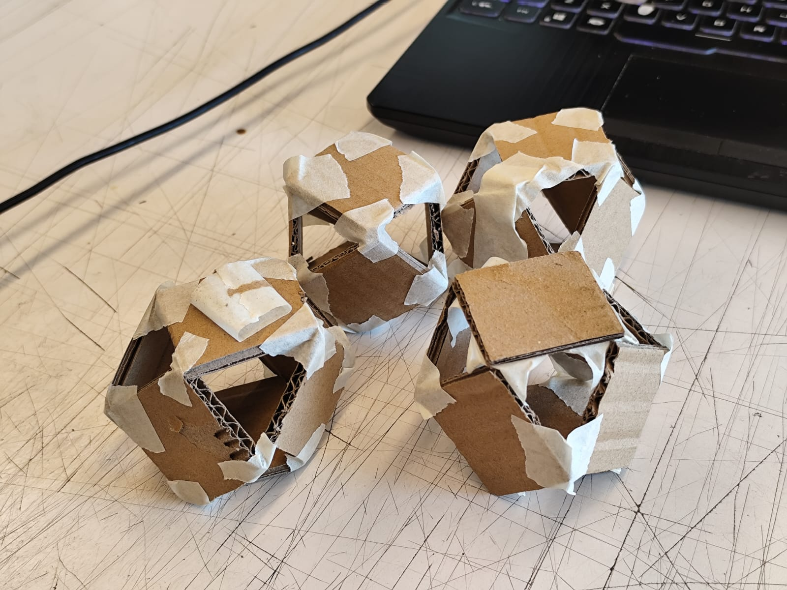

Se usó cartón y maskintape para realizar vóxeles cuboctaédricos. Para ello se unen 6 cuadrados, punta con punta, dejando espacios triangulares entre los lados de cada cuadrado.

 

Básicamente se improvisó un brazo robótico utilizando cartón, maskin, y un brazo robótico.
